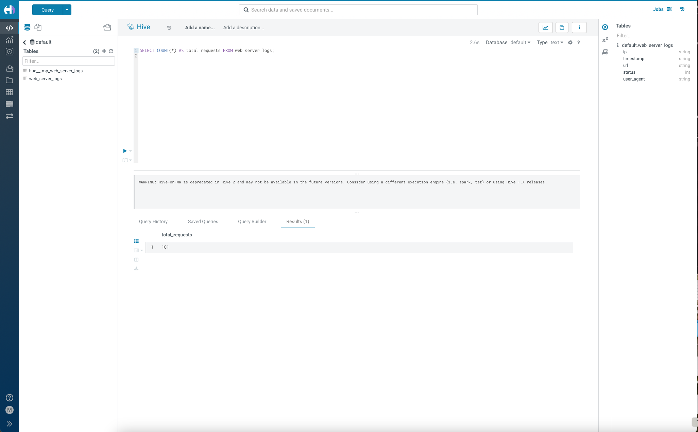

# Web-Server-Log-Analysis
Web Server Log Analysis using Apache Hive

Project Overview

This project implements an analytical process using Apache Hive to analyze web server logs stored in a CSV file. The goal is to extract meaningful insights about website traffic patterns, including total requests, status code analysis, most visited pages, user agent statistics, suspicious activity detection, and traffic trends over time.

Step 1: Upload the CSV File to HDFS
1. First, ensure that your Hadoop and Hive services are running.
2. Use the following command to create a directory in HDFS for your logs:
    hdfs dfs -mkdir -p /user/hive/web_logs
3. Now, upload your web_server_logs.csv file to HDFS:
    hdfs dfs -put /web_server_logs.csv /user/hive/web_logs/
4. Verify that the file is successfully uploaded:
    hdfs dfs -ls /user/hive/web_logs/

Execution Steps

1. Setup Apache Hive and Hadoop

Install Hadoop and Hive on your system.

Start the Hadoop and Hive services using:

2. Create Hive Table

CREATE EXTERNAL TABLE IF NOT EXISTS web_server_logs (
    ip STRING,
    `timestamp` STRING,
    url STRING,
    status INT,
    user_agent STRING
) ROW FORMAT DELIMITED FIELDS TERMINATED BY ','
STORED AS TEXTFILE LOCATION '/user/hive/warehouse/web_logs';

3. Load Data into Hive

LOAD DATA INPATH '/user/hive/web_logs/web_server_logs.csv' INTO TABLE web_server_logs;

4. Run Queries and Verify Outputs

Execute the SQL queries mentioned in the Implementation Approach section.

Implementation Approach

The following queries were used to perform the required analyses:
1.Count Total Web Requests

SELECT COUNT(*) AS total_requests FROM web_server_logs;

2.Analyze Status Codes (Frequency Count)

SELECT status, COUNT(*) AS count FROM web_server_logs GROUP BY status ORDER BY count DESC;

3.Identify the Most Visited Pages (Top 3 URLs)

SELECT url, COUNT(*) AS visit_count FROM web_server_logs GROUP BY url ORDER BY visit_count DESC LIMIT 3;

4.Traffic Source Analysis (Most Common User Agents)

SELECT user_agent, COUNT(*) AS count FROM web_server_logs GROUP BY user_agent ORDER BY count DESC LIMIT 3;

5.Detect Suspicious Activity (IPs with More Than 3 Failed Requests)

SELECT ip, COUNT(*) AS failed_requests FROM web_server_logs WHERE status IN (404, 500) GROUP BY ip HAVING COUNT(*) > 3 ORDER BY failed_requests DESC;

6.Analyze Traffic Trends (Requests per Minute)

SELECT SUBSTR(timestamp, 1, 16) AS request_minute, COUNT(*) AS request_count FROM web_server_logs GROUP BY SUBSTR(timestamp, 1, 16) ORDER BY request_minute;

Challenges Faced

Hive Table Not Loading Data Properly

Solution: Ensured the CSV file was correctly formatted with no missing delimiters.

HDFS Not Recognized in Commands

Solution: Verified Hadoop services were running and added Hadoop bin to system PATH.

Hive Execution Warnings

Solution: Used Tez as the execution engine instead of deprecated Hive-on-MR.